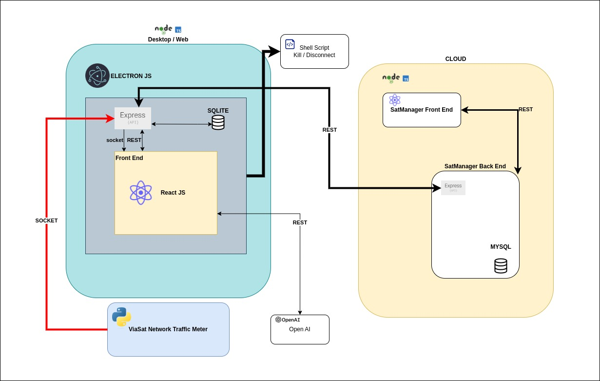

# SatStat

Esse projeto faz parte do hackathon Inatel App Challenge 2023, onde desenvolvemos uma aplicação de monitoramento do consumo da rede local do usuário.

## Table of Contents

- [Descrição do Projeto](#descrição-do-projeto)
- [Funcionalidades](#funcionalidades)
- [Instalação](#instalação)
- [Uso](#uso)
- [Contato](#contato)

## Descrição do Projeto

Em nossa solução, propomos uma aplicação capaz de monitorar as aplicações que mais consomem recursos na rede local, bem como analizar o consumo geral, definir limites de consumo, cortar a conexão de aplicações com a rede local caso os limites sejam atingidos e gerar relatórios relativos ao histórico de consumo.

Além disso, propomos uma plataforma complementar ao SatStat, o SatStatManager, com o objetivo gerenciar e analizar o comportamento de clientes por região, bem como provisionar suporte para os mesmos caso necessário.

Segue em anexo a arquitetura planejada para a solução:



Nossa aplicação foi dividida em vários repositórios, sendo eles:

- [SatStatClientServer](https://github.com/SatStat/SatStatClientServer), o repositório com a aplicação principal, com o tratamento de dados, o servidor backend, e o frontend servido como arquivos estáticos, responsável pelo monitoramento do consumo de rede do usuário. É uma aplicação facilmente portável para outras plataformas além de Windows. Infelizmente, devido ao tempo, não integramos as funcionalidades do backend com o frontend.

- [SatStatClientServer](https://github.com/SatStat/Viasat-NetworkTrafficMeter), repositório da ViaSat, responsável por coletar as métricas de rede consumidas pelo SatStatClientServer

- [SatStatClientServer](https://github.com/SatStat/SatStat), o repositório com o front end da aplicação principal

- [SSDB](https://github.com/SatStat/SSDB), repositório responsável pelo projeto do banco de dados em Nuvem, projeto incompleto e ainda não integrado com o backend

Também criamos um repositório e projeto para o servidor da plataforma de Gerenciamento, entretanto, também não foi possível avançar significamente nessa parte

Também planejamos um termo de uso para a aplicação, com base na LGPD, que pode ser encontrado a seguir:

- [Termos de Uso](./docs/lgpd.md)

## Funcionalidades

- Gerenciamento das aplicações que mais consomem tráfego de rede (Parcialmente implementado)
- Configuração de limites e alertas de consumo para cada aplicação (Parcialmente implementado)
- Finalização do processo da aplicação que ultrapassa o limite de consumo (Não implementado)
- Geração de relatórios (parcialmente implementado)
- [Geração de relatórios por inteligência artificial](https://github.com/SatStat/SatStatClientServer/tree/naturalLenguage) (implementado apenas no backend)
- Plataforma de gestão do fornecedor de internet (não implementado)

## Instalação

Primeiramente, instale o NodeJs, versão 18.05: [NodeJs](https://nodejs.org/en)

Acesse o repositório [SatStat](https://github.com/SatStat/SatStat), clone e execute os seguintes comandos no terminal:
```
npm i

npm run build

```

Copie o conteúdo da pasta <b>build</b>

Clone o repositório: [SatStatClientServer](https://github.com/SatStat/SatStatClientServer)

Cole o conteúdo copiado anteriormente na pasta <i>/src/public</i>

Execute os seguintes comandos para executar a aplicação no modo de desenvolvimento:

```
npm i

npm run electron:dev

```


## Uso

Um overview da aplicação foi apresentado no seguinte video:
[](https://youtu.be/jn8kYSdKeEg)

## Contato

- [Diego Anestor Coutinho](https://github.com/DIEGOVZK)
- [Paulo Henrique Lopes Junior](https://github.com/paulolopestech)